<div align="center">

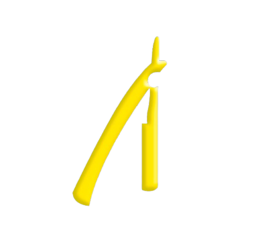

# ALPHA PRIME

**Barbearia · Juiz de Fora, MG**

*Referência e qualidade, agora também na experiência digital.*

<br>


<br>

[Visão geral](#visão-geral) ·
[A experiência](#a-experiência) ·
[Funcionalidades](#funcionalidades) ·
[Arquitetura](#arquitetura) ·
[Como executar](#como-executar) ·
[Estado do projeto](#estado-do-projeto)

<br>


<sub>Sequência real de abertura: intro cinematográfica → revelação do hero → entrada do header.</sub>

</div>

<br>

## Visão geral

O **Alpha Prime** é o site institucional da Alpha Prime Barbearia, referência em estética masculina em Juiz de Fora (MG). Em uma única página, ele apresenta todos os domínios do negócio (serviços, equipe, clube de assinaturas, programa de fidelidade, loja de produtos, unidade física com tour 360°, escola de barbeiros, franquia e parcerias) com a mesma linguagem premium, em preto e dourado, que define a marca no espaço físico.

O diferencial está na execução: toda a experiência, da intro cinematográfica ao menu fullscreen com ícone que se transforma, do carrossel de equipe às microinterações em cada elemento, foi construída **sem nenhum framework, biblioteca ou etapa de build**. HTML semântico, CSS puro e JavaScript vanilla, do primeiro pixel ao último. O resultado é um projeto sem dependências para instalar, sem pipeline para manter e que roda em qualquer servidor estático.

| | |
|---|---|
| **Produto** | Site institucional one-page (pt-BR) |
| **Stack** | HTML5 · CSS3 · JavaScript (ES6+) |
| **Dependências** | Nenhuma: sem build, sem gerenciador de pacotes |
| **Interface** | Concluída: 10 seções, header, intro e rodapé, responsivos de ultrawide a ~340 px |
| **Pendências** | Integrações externas dos CTAs e conteúdo definitivo de equipe/parceiros ([detalhes](#estado-do-projeto)) |

## O projeto

Uma barbearia que se posiciona como premium não pode ter uma presença digital genérica. O site foi desenhado para transportar a identidade do espaço físico (iluminação baixa, detalhes dourados, acabamento cuidadoso) para o navegador, e para concentrar em um único endereço tudo o que hoje se espalha entre redes sociais e boca a boca: o que a barbearia oferece, quem atende, quanto vale o clube de assinaturas, onde fica a unidade e como se tornar franqueado ou aluno da escola.

Quatro princípios orientaram o desenvolvimento:

1. **A identidade comanda.** Paleta, tipografia e movimento derivam da marca, não de um template.
2. **Movimento como assinatura.** Cada seção tem vida própria: nada aparece na tela sem uma transição pensada, e nada se move sem propósito.
3. **A plataforma é o framework.** Recursos nativos (CSS Grid, `clamp()`, SVG sprite, `requestAnimationFrame`) substituem bibliotecas inteiras.
4. **Modularidade por seção.** Cada bloco da página tem sua própria folha de estilo, e todas as media queries vivem em um único arquivo, o que mantém as mudanças locais e previsíveis.

## A experiência

### Identidade visual

O sistema visual é construído sobre tokens CSS declarados em [`css/style.css`](css/style.css). Os títulos não usam cor sólida: recebem gradientes reais recortados no texto (`background-clip: text`), o que dá o acabamento metálico característico do site.

| Token | Composição | Uso |
|---|---|---|
| `--gold-gradient` | `#c79d1f → #fee800 → #988000` | Títulos e destaques dourados |
| `--white-premium` | `#ffffff → #f1ead7` | Títulos claros com acabamento quente |
| `--text-soft-white` | `#ddd6c8` | Texto corrido sobre fundo escuro |
| Base | `#000` / `#0A0A0A` | Fundo de todas as seções e do menu |

A tipografia é serifada (Georgia) em toda a página, reforçando o tom clássico da marca, com tamanhos fluidos via `clamp()`: os textos escalam continuamente entre mobile e ultrawide sem saltos.

### Sistema de movimento

<div align="center">

| Menu fullscreen | Carrossel da equipe |
|:---:|:---:|
| 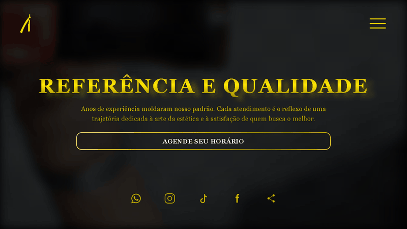 | 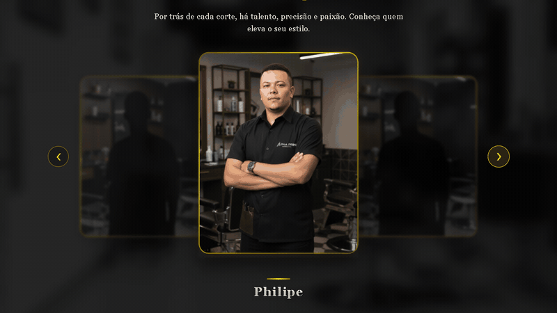 |

</div>

- **Intro cinematográfica:** a página abre em preto, aguarda o vídeo do hero estar pronto (com fallback de 1,2 s), revela a logo e então entrega a página. O overlay é removido do DOM ao final, sem custo residual.
- **Header que entra em cena:** logo e botão do menu surgem com blur + deslocamento somente depois da intro, encadeados por delays.
- **Morph hambúrguer ↔ X:** o ícone do menu é um SVG cujas barras transladam e rotacionam em duas fases coreografadas, dirigidas apenas por CSS a partir do atributo `aria-expanded` do botão.
- **Carrossel com profundidade:** o card ativo flutua em loop suave; os vizinhos recuam com escala, blur e opacidade reduzidos, criando leitura de camadas sem WebGL.
- **Microinterações generalizadas:** títulos, botões, cards de serviço, ícones sociais e o cartão de localização respondem ao hover com elevação, brilho e sombras douradas (apenas em dispositivos com ponteiro fino, via media query `hover: hover`).
- **Rolagem assinada:** a navegação do menu usa animação de scroll própria (`requestAnimationFrame` + easing cúbico, ~900 ms) com offset individual por link, em vez do scroll nativo.
- **Movimento reduzido respeitado:** `prefers-reduced-motion` zera durações e delays das animações do header.

## Funcionalidades

| Seção | O que entrega |
|---|---|
| **Hero** | Vídeo da barbearia em loop (com blur e overlay), título-manifesto, CTA de agendamento e ícones sociais |
| **Serviços** | Seis cards fotográficos (corte, barba, corte + barba, sobrancelha, limpeza facial, pigmentação) com overlay dourado |
| **Equipe** | Carrossel circular com autoplay (3,8 s), navegação manual e legenda que se reanima a cada troca |
| **Clube de Assinaturas** | Apresentação do clube com arte própria: cortes ilimitados, brindes e vantagens em parceiros |
| **Fidelidade & Combos** | Duas fileiras espelhadas com seis cards iconográficos flutuantes sobre fotos do espaço |
| **Loja** | Vitrine com produto em destaque sob glow dourado e grade de produtos da linha própria |
| **Unidades** | Cartão de localização com Google Maps + tour virtual 360° (Street View), ambos com trava anti-scroll acidental |
| **Escola de Barbeiros** | Chamada institucional para a formação de novos profissionais |
| **Contato & Franquia** | Contato, trabalhe conosco, expansão por franquias e a história da marca |
| **Parceiros** | Grade de marcas parceiras com convite a novas parcerias |
| **Rodapé** | Contatos, horários de funcionamento, logo central e redes sociais |

<div align="center">

| | |
|:---:|:---:|
| 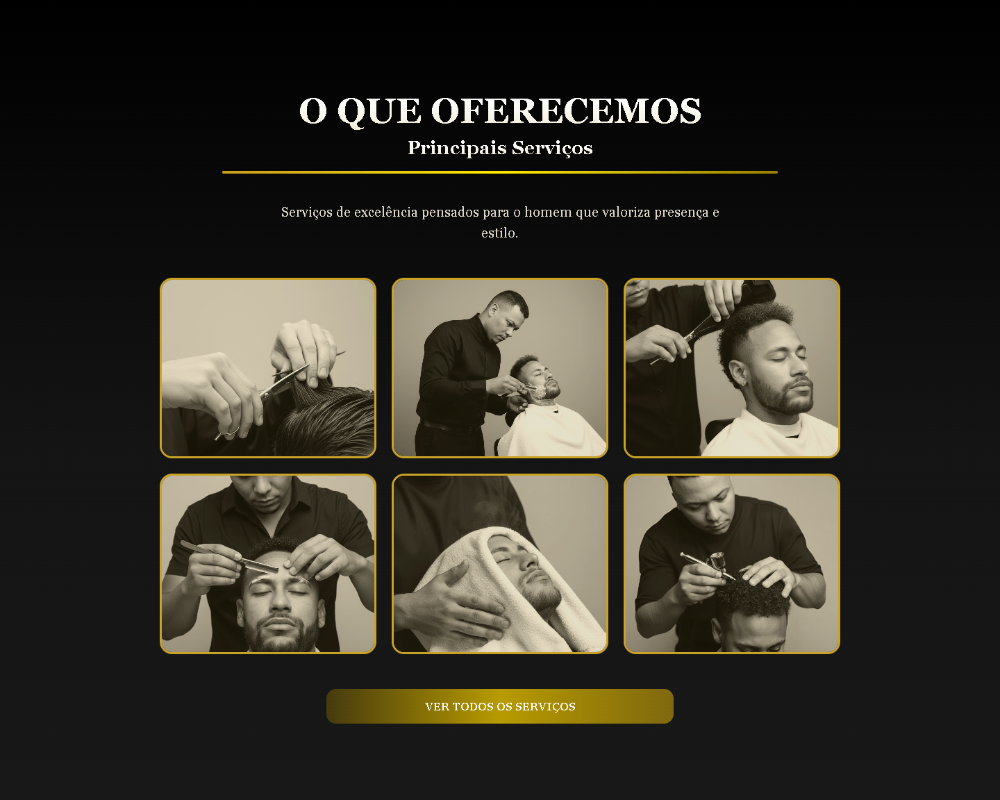 | 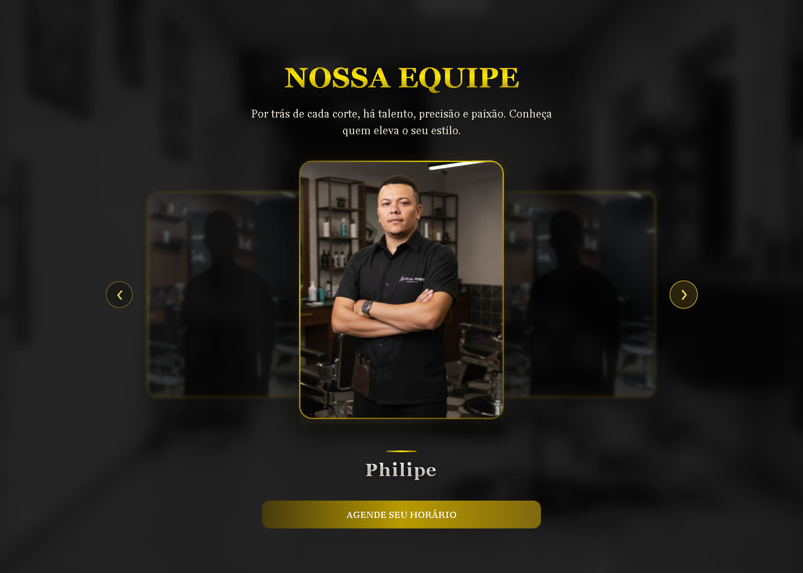 |
| <sub>Serviços</sub> | <sub>Equipe</sub> |
| 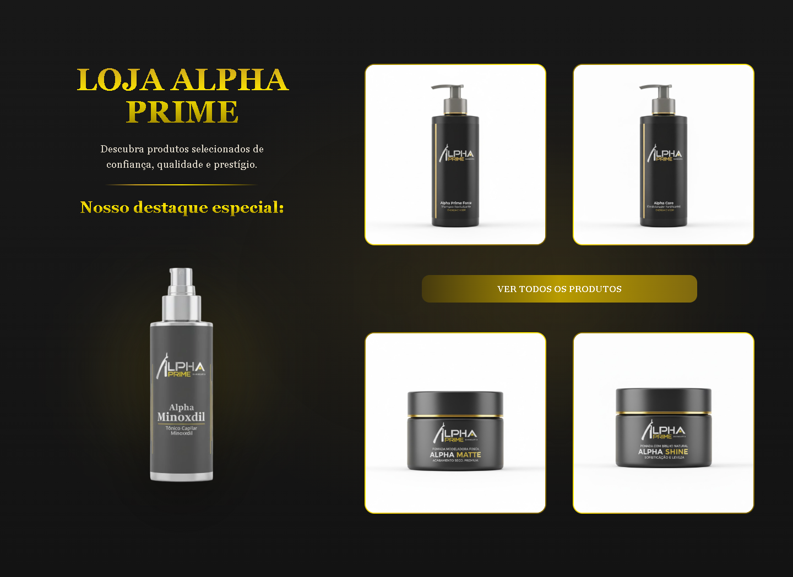 | 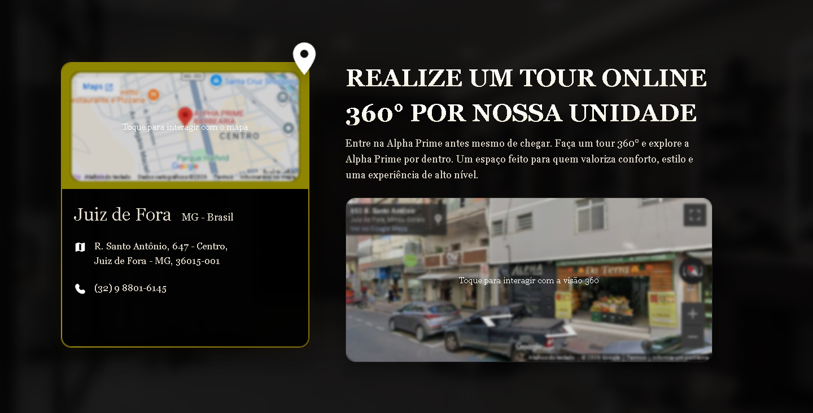 |
| <sub>Loja</sub> | <sub>Unidade: mapa e tour 360°</sub> |

</div>

<details>
<summary><strong>Galeria completa</strong>: todas as seções, desktop e mobile</summary>

<br>

<div align="center">

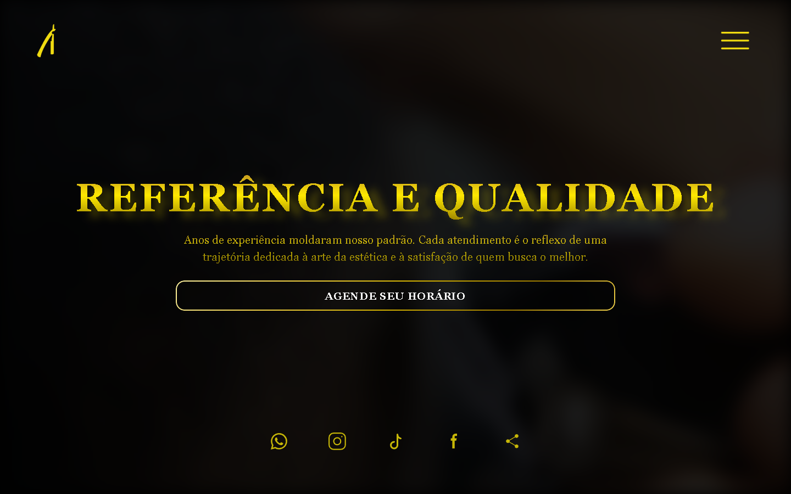
<br><sub>Hero (desktop)</sub><br><br>

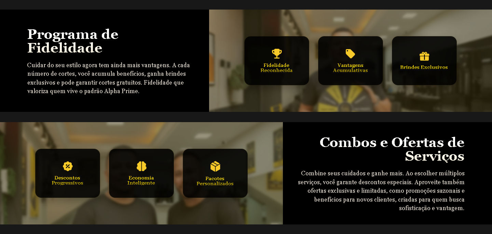
<br><sub>Programa de Fidelidade · Combos e Ofertas</sub><br><br>

| | |
|:---:|:---:|
| 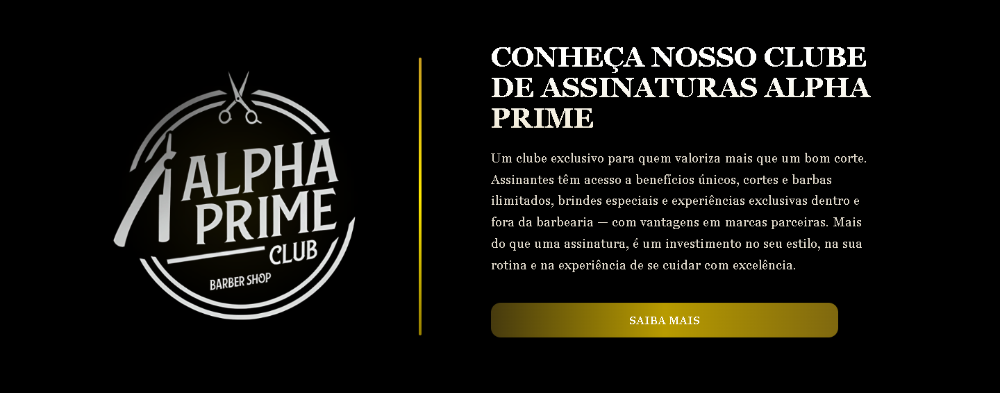 | 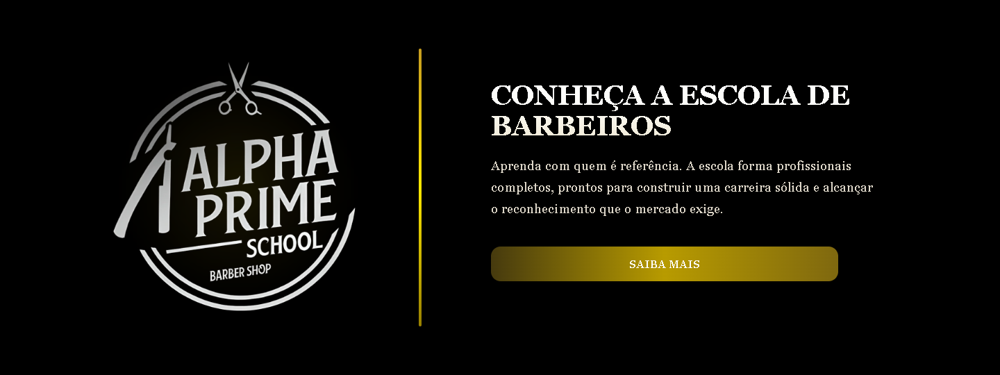 |
| <sub>Clube de Assinaturas</sub> | <sub>Escola de Barbeiros</sub> |
| 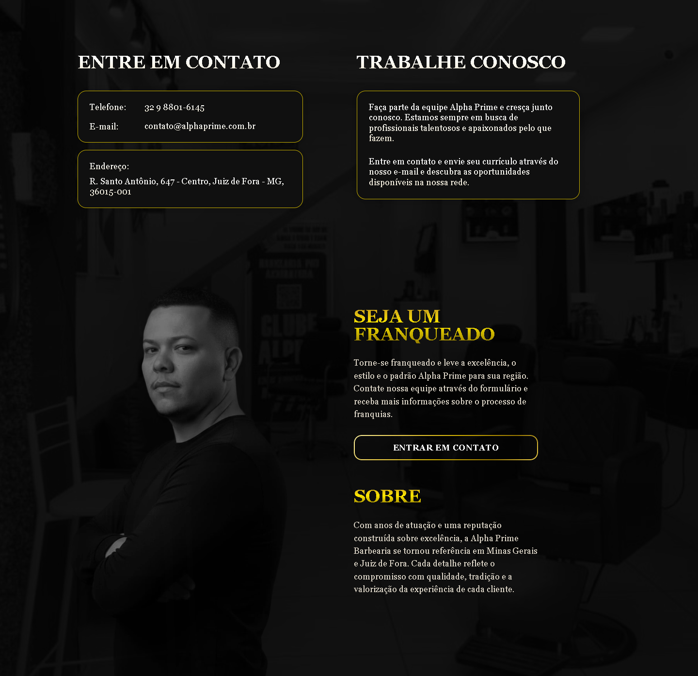 | 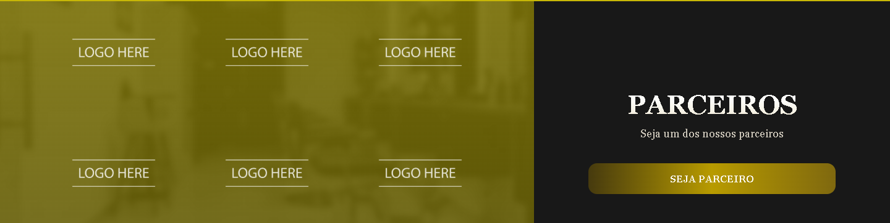 |
| <sub>Contato & Franquia</sub> | <sub>Parceiros</sub> |
| 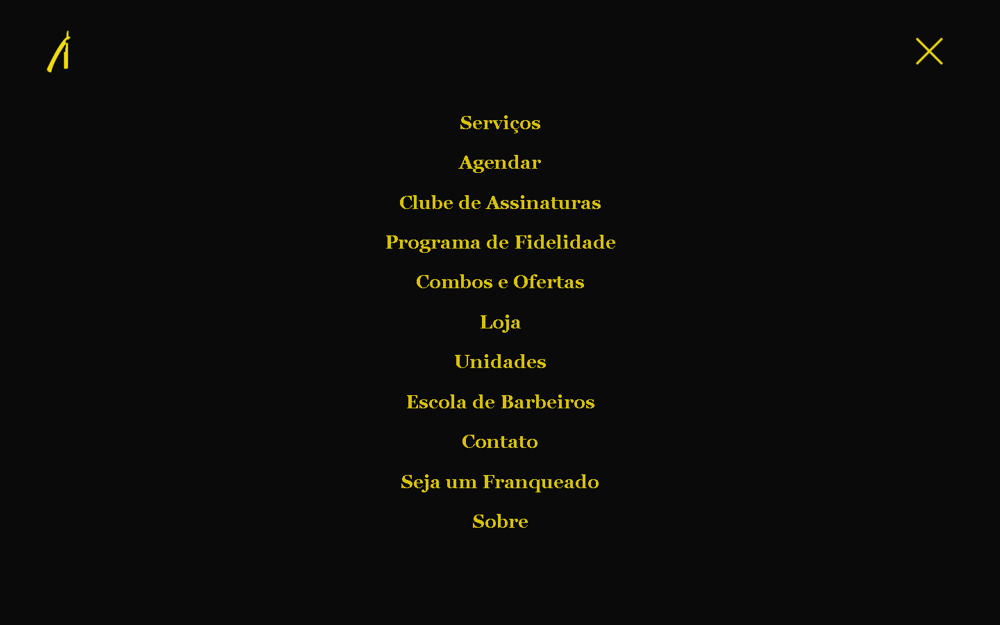 | 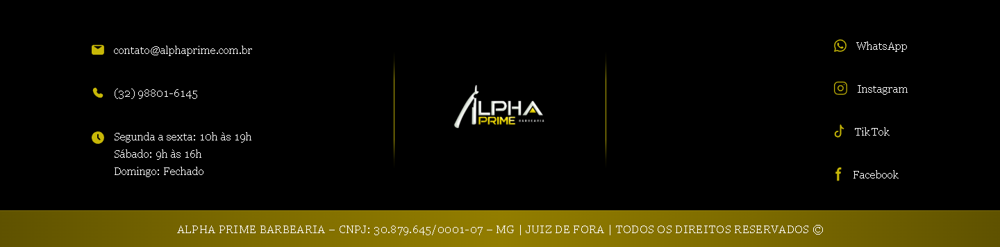 |
| <sub>Menu fullscreen</sub> | <sub>Rodapé</sub> |

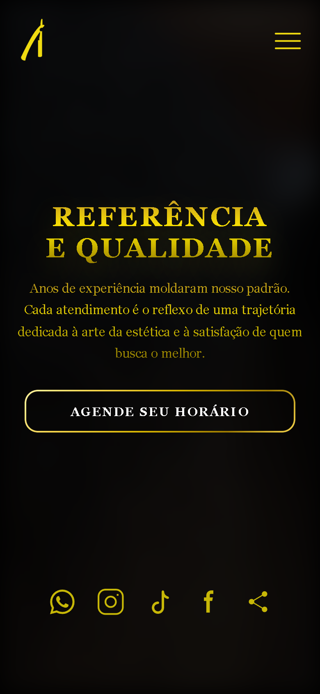
<br><sub>Hero (mobile · 390 px)</sub>

</div>

</details>

## Arquitetura

A aplicação é uma página única servida como arquivo estático, organizada em três camadas independentes: **estrutura** ([`index.html`](index.html)), **estilo** (16 folhas em [`css/`](css/)) e **comportamento** ([`js/script.js`](js/script.js)). Não há estado global, dados externos nem back-end; os únicos serviços de terceiros são os dois embeds do Google Maps (mapa e Street View), carregados com `loading="lazy"`.

### Fluxo de abertura

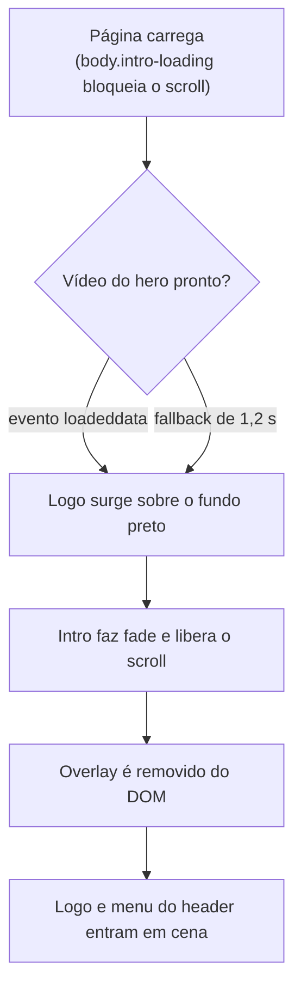

### Camada de estilo

A ordem de importação no `<head>` é a arquitetura: `reset.css` normaliza, `style.css` define os tokens e componentes globais (botões, gradientes de texto, intro), cada seção carrega sua folha própria e, **por último**, `responsive.css` concentra todas as media queries; a posição final na cascata garante que as adaptações vençam sem `!important`. Os breakpoints cobrem de telas ultrawide (`min-width: 1920px`) a aparelhos compactos (`max-width: 340px`), complementados por dimensões fluidas com `clamp()` na tipografia, espaçamentos e componentes.

### Camada de comportamento

Um único script (~410 linhas), organizado em módulos IIFE independentes:

| Sistema | Responsabilidade |
|---|---|
| **Intro** | Sincroniza a abertura com o carregamento do vídeo e desmonta o overlay ao final |
| **Header & menu** | Estado compacto ao rolar, menu fullscreen, morph do ícone via `aria-expanded`, focus trap, fechamento por `Esc`, *scroll spy* que marca o link da seção visível |
| **Rolagem animada** | Scroll suave próprio com easing cúbico e offset configurável por link (`data-target` / `data-offset`) |
| **Carrossel da equipe** | Rotação circular de 3 posições com autoplay, controles manuais e legenda reanimada |
| **Trava dos mapas** | Overlays `is-locked` / `is-unlocked` impedem que os iframes do Google capturem o scroll da página até um clique intencional |

### Sistema de ícones

Todos os ícones, incluindo a logo, vivem em um único sprite ([`assets/icons/sprite.svg`](assets/icons/sprite.svg), 19 símbolos) referenciado por `<use>`: uma requisição para todo o conjunto, cor herdada via `currentColor` e animação por CSS quando necessário (como no morph do menu). Os arquivos `.xml` na mesma pasta são as fontes individuais de cada símbolo.

## Estrutura do repositório

```
alphaprime-website/
├── index.html            # Página única: intro, header, 10 seções e rodapé
├── css/
│   ├── reset.css         # Normalização mínima
│   ├── style.css         # Tokens de design, botões, gradientes de texto, intro
│   ├── sections.css      # Utilitários compartilhados entre seções
│   ├── header.css        # Header fixo, menu fullscreen e morph do ícone
│   ├── hero.css … units.css   # Uma folha por seção da página
│   └── responsive.css    # Todas as media queries, centralizadas (carrega por último)
├── js/
│   └── script.js         # Intro, header/menu, rolagem, carrossel e trava dos mapas
├── assets/
│   ├── icons/            # sprite.svg (símbolos <use>) + fontes .xml individuais
│   ├── images/           # Fotografia, logos, artes e retratos das seções
│   └── video/            # Vídeo de fundo do hero
└── docs/
    └── media/            # Capturas e GIFs usados nesta documentação
```

## Tecnologias

| Tecnologia | Aplicação no projeto |
|---|---|
| **HTML5 semântico** | Estrutura da página, acessibilidade (ARIA) e SEO on-page |
| **CSS3 puro** | Design system por tokens, Grid/Flexbox, gradientes em texto, animações e responsividade fluida |
| **JavaScript (ES6+)** | Interações: intro, menu, carrossel, scroll spy, rolagem animada e trava dos mapas |
| **SVG sprite** | Ícones e logo em requisição única, coloridos e animados via CSS |
| **Google Maps Embed** | Mapa da unidade e tour virtual 360° (Street View) |

## Como executar

**Requisitos:** um navegador moderno e qualquer servidor de arquivos estáticos (Python 3 e Node atendem; nenhuma dependência é instalada).

```bash
# 1. Clone o repositório
git clone https://github.com/JonathanDelmonte/barbershop-web-project.git
cd barbershop-web-project

# 2. Sirva a pasta (escolha uma opção)
python -m http.server 8137
# ou
npx serve .

# 3. Abra no navegador
# http://localhost:8137
```

> [!IMPORTANT]
> Sirva o projeto por HTTP em vez de abrir o `index.html` direto do disco: com `file://`, os navegadores bloqueiam as referências externas do sprite SVG (`<use href="assets/icons/sprite.svg#...">`) e os ícones não aparecem.

Não há etapa de build: o que está no repositório é exatamente o que vai para produção.

### Deploy

Qualquer hospedagem estática (GitHub Pages, Netlify, Vercel, Cloudflare Pages) serve o site sem ajustes. A publicação atual é feita em GitHub Pages, em repositório de publicação separado deste; aqui fica a fonte de desenvolvimento.

## Acessibilidade e responsividade

- Navegação do menu completa por teclado: focus trap enquanto aberto, fechamento por `Esc` e devolução do foco ao botão.
- Estados comunicados por ARIA (`aria-expanded`, `aria-controls`, `aria-hidden`) e rótulos descritivos em botões, links de ícone e iframes.
- Indicador de foco visível (`:focus-visible`) em dourado sobre os elementos interativos do header.
- `prefers-reduced-motion` reduz as animações de entrada e o morph do menu a durações imperceptíveis.
- Layout validado de ultrawide (≥1920 px) a aparelhos compactos (≤340 px), com media queries centralizadas e tipografia fluida.
- Os iframes do Google Maps só recebem interação após clique explícito, evitando sequestro de scroll, especialmente no toque.

## Estado do projeto

**Em preparação para produção.** A interface está concluída; restam as integrações externas e a substituição de conteúdos provisórios.

| Frente | Estado |
|---|---|
| Interface das 10 seções + intro, header e rodapé | ✔ Concluída |
| Responsividade e tipografia fluida | ✔ Concluída |
| Sistema de movimento e microinterações | ✔ Concluído |
| Acessibilidade base (ARIA, teclado, reduced motion) | ✔ Concluída |
| CTAs externos (agendamento, loja, redes sociais) | ◌ Aguardando os links definitivos (hoje apontam para `#`) |
| Retratos da equipe e logos de parceiros | ◌ Parcialmente provisórios |
| Metadados de SEO (description, Open Graph, favicon) | ◌ Pendentes |
| Otimização do vídeo de fundo (~28 MB) | ◌ Pendente |

## Autoria e direitos

Desenvolvido por **Jonathan Delmonte**.

Projeto proprietário: a marca, as fotografias, as artes e o conteúdo pertencem à Alpha Prime Barbearia. Todos os direitos reservados. Este repositório não possui licença de código aberto.

<br>

<div align="center">


<sub>**ALPHA PRIME BARBEARIA** · Juiz de Fora, MG</sub>

</div>
